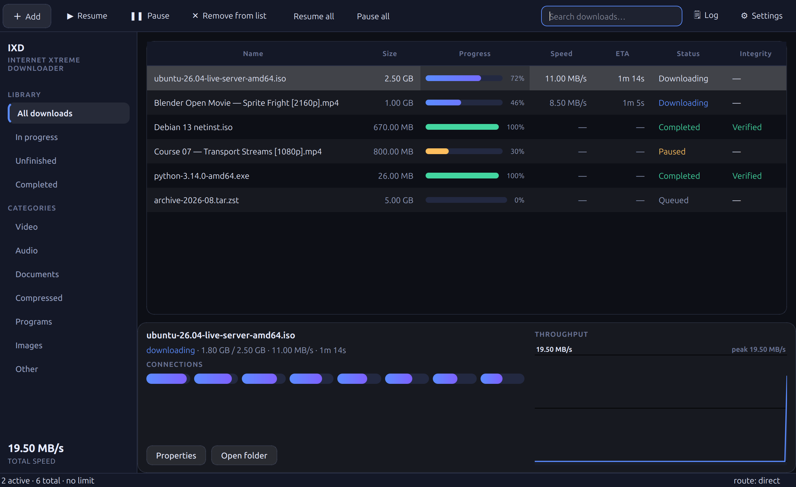
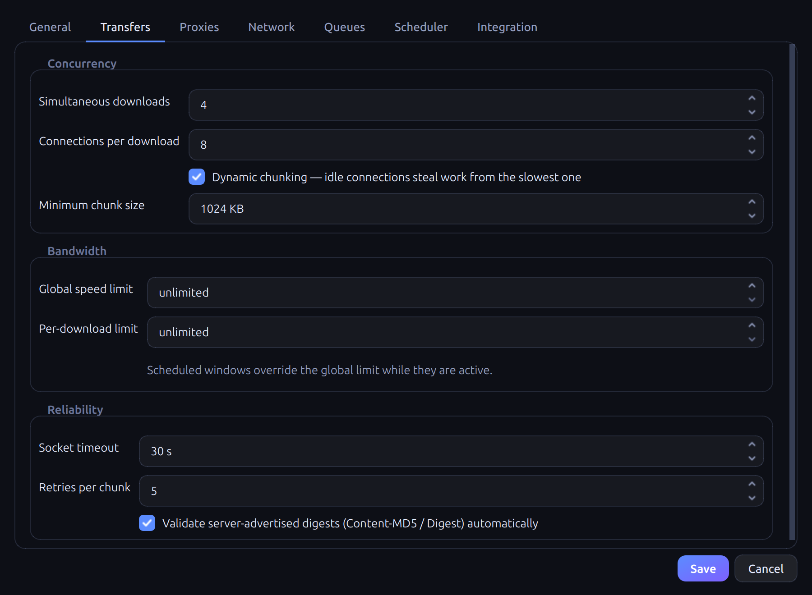
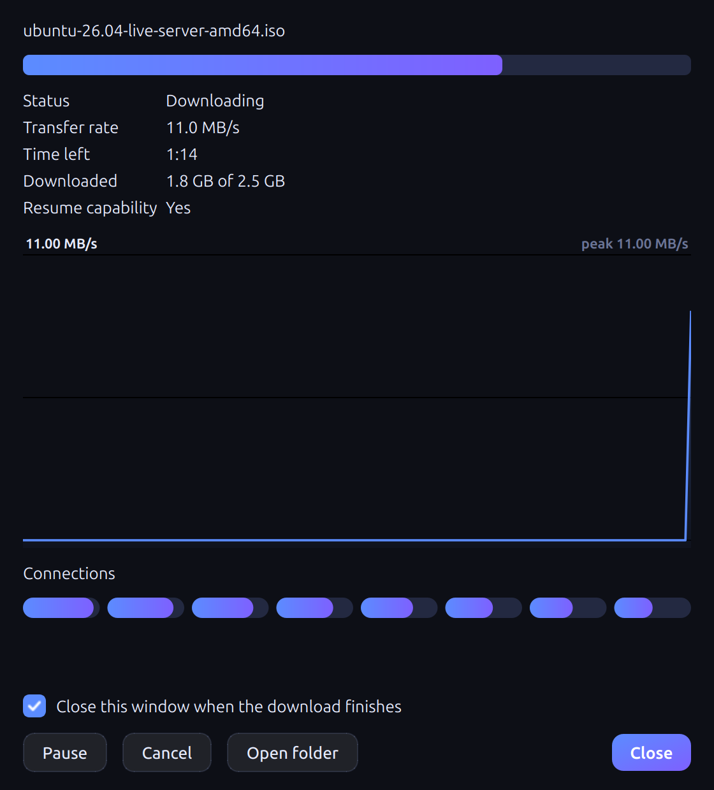

<div align="center">


# IXD — Internet Xtreme Downloader

**A free download manager for Windows, Linux and macOS that depends on
nothing.**
Multi-threaded accelerated transfers, byte-exact resume, native media
extraction, browser integration, proxy routing and scheduling — with no
`yt-dlp`, no `ffmpeg`, no `curl`, and no runtime dependency beyond Qt.
Open source, no ads, no account, no paid tier.

**[ixd — the website](https://arminmacx.github.io/IXD/)** · [Download](https://github.com/arminmacx/IXD/releases/latest) · [Report a problem](../../issues/new/choose)

[](https://github.com/arminmacx/IXD/actions/workflows/tests.yml)
[](https://github.com/arminmacx/IXD/actions/workflows/release.yml)
[](https://www.python.org/)
[](https://doc.qt.io/qtforpython/)
[](#installation)
[](#testing)
[](#no-external-binaries)
[](LICENSE)
[](TRADEMARK.md)



</div>

---

> ### Beta
>
> This is a beta. It is used daily on Linux and Windows, but it has not been
> through the range of sites, networks and machines that would make it
> trustworthy by default. **If something does not work, please
> [open an issue](../../issues/new/choose)** — the report template asks for
> the log, which is usually the whole answer.
>
> **The macOS build is unverified.** It compiles and packages on a macOS
> runner, and nobody has yet launched it on real hardware. If you run it on a
> Mac, a report either way is genuinely useful — including "it just worked".

---

## Why it exists

Every download manager that handles modern video shells out to something. IXD
does not. HTTP/1.1, SOCKS5, protobuf, UMP, AES-128, ISOBMFF, Matroska,
MPEG-TS and WebSocket are all implemented in this repository, which is why a
build is one binary with one dependency and why nothing here can be broken by
a tool it does not ship.

| | |
|---|---|
| **Transfers** | Range chunking with dynamic work stealing, byte-exact resume, crash recovery |
| **Media** | YouTube · Vimeo · HLS · DASH · SABR, muxed natively into MP4 or WebM |
| **Browser** | MV3 extension over native messaging — snap and flatpak included |
| **Routing** | HTTP/HTTPS/SOCKS5 proxies, pool rotation, interface binding |
| **Integrity** | MD5 · SHA-1 · SHA-256 · SHA-512 · BLAKE2b, plus server digests |

---

## Features

### Transfer engine

- **Dynamic chunking.** A connection that finishes early splits the busiest
  remaining chunk instead of idling, so the tail of a download stays parallel.
- **Byte-exact resume.** Chunk cursors live in SQLite (WAL): pause, resume,
  and full recovery after a crash or a network drop.
- **Resume is answered per transfer mode.** A segmented download resumes on
  the segments already written; a server-driven one on the position recorded
  in its session state. Neither uses a `Range` header, and both resume.
- **Completeness guard.** A file is never published unless every byte of every
  chunk is accounted for — a silently zero-filled hole is impossible.
- **Link swapping.** A `403`/`410` on a URL that already served bytes is
  recognised as an expired token, not a permission error: the download parks,
  asks for a fresh URL, and continues over the existing chunk map.

### Media extraction

- **No wrapper, a plugin registry.** YouTube (InnerTube multi-client, watch
  page fallback, native signature deciphering), Vimeo, HLS with AES-128,
  DASH (`SegmentTemplate` / `SegmentTimeline` / `SegmentList` / `SegmentBase`)
  and a generic page scraper.
- **Native muxing, in both containers.** Adaptive video and audio arrive as
  separate tracks and are combined into one playable file — ISOBMFF for
  H.264 + AAC, Matroska for the VP9/AV1 + Opus pairs every 60fps and
  above-1080p rendition is published as. Verified against an independent
  demuxer.
- **Server-driven streaming (SABR)** implemented from scratch — protobuf
  request, UMP-framed response — for media that publishes no fetchable URL.
- **MPEG-TS is rewrapped, not concatenated.** Every coded frame is copied into
  a real MP4 with sample tables and a seek index; a stream that cannot be
  described is kept as `.ts` rather than published broken.
- **Media is checked by its first bytes.** A segment answered with an error
  page or a login wall is refused, never published as a file with the right
  name and nothing playable in it.

### Browser integration

- **Registers itself.** The messaging host is installed for every browser
  found — distribution package, **snap** or **flatpak**, each of which keeps
  its profile somewhere different — and the extension's ID is fixed by a key
  in its manifest, so the host is authorised before the extension is loaded.
- **Snap browsers are handled properly.** Their AppArmor profile refuses to
  execute anything under a dotted path in `$HOME`, so each snap browser gets a
  small relay inside its own `~/snap/<browser>/common/` area, running on the
  interpreter the snap runtime provides.
- **Nothing is lost on failure.** A captured download is handed *back* to the
  browser if the engine is unreachable.
- **An in-page panel** fades in over any video you hover — click it for the
  quality list, click a quality to fetch it. Rendered in a shadow root, so no
  site's CSS can deform it.
- **Capture-first.** What the browser already fetched is consulted before the
  site is asked anything, and the real request's headers are replayed rather
  than reconstructed.

### Routing, scheduling, integrity

- Native HTTP, HTTPS and SOCKS5/SOCKS5h with authentication; **follow the
  system proxy** read from the environment, GNOME, KDE, macOS or the Windows
  registry, bypass list included.
- Proxy pool with rotation on `403 / 407 / 429 / 451 / 503` and transport
  failures, plus failure-count retirement.
- OS-level interface binding — pin traffic to `tun0`, `wg0` or a literal
  address regardless of the system default route.
- Recurring schedules (day mask, midnight-crossing) that start, pause or stop
  queues and impose time-of-day bandwidth caps.
- Automatic validation of `Content-MD5`, `Digest` and `Repr-Digest`, and a
  paste-your-own-hash field with an unambiguous **Verified** / **Corrupted**
  indicator.

---

## Installation

### Download a build

Every release is built on all three operating systems by CI and attached to
the [Releases](../../releases) page — nothing to compile.

Every platform has both: an **installer**, and a **portable** copy that keeps
its files wherever you put it and can replace itself in place when a new
version appears.

| Platform | Installer | Portable |
|---|---|---|
| Windows | `ixd-1.0.20-windows-x64-setup.exe` | `ixd-1.0.20-windows-x64.zip` → extract, run `ixd.exe` |
| macOS (Apple silicon) | `ixd-1.0.20-macos-arm64.pkg`, or the `.dmg` | `ixd-macos-arm64.zip` |
| Debian / Ubuntu | `ixd_1.0.20_amd64.deb` → `sudo dpkg -i ixd_1.0.20_amd64.deb` | `ixd-linux-x86_64.tar.gz` → extract, run `ixd/ixd` |

The **Windows installer asks who it is for**: *everyone* needs administrator
and installs to `Program Files`; *just me* needs nothing and installs to
`%APPDATA%\IXD`. See the note below on the SmartScreen warning; the **first**
launch also takes a while, because Windows scans the whole folder before
running anything from it.

macOS is unsigned either way, so right-click → **Open** the first time —
and it is **unverified: never launched on real hardware**.

The `*-selfupdate*` archives are the portable copies that are allowed to
replace their own folder when a new version appears. The ordinary ones never
touch themselves.

### Or build it yourself

One script per platform. Each finds a suitable Python, **installs one if there
is none**, creates the environment and produces the packages:

```bash
./packaging/linux/build.sh          # .deb + portable + AppDir
./packaging/macos/build.sh          # .app + .dmg
```
```bat
packaging\windows\build.bat         :: dist\ixd\ixd.exe + zip
```

Add `--with-tests` to run the offline suites first, or `--no-install` to fail
rather than install anything. Everything is logged to `build-<os>.log`.

### Run from source

The system Python is PEP 668 managed, so use a virtual environment:

```bash
python3 -m venv --without-pip .venv
curl -sS https://bootstrap.pypa.io/get-pip.py | .venv/bin/python
.venv/bin/pip install -r requirements.txt

.venv/bin/python -m ixd                    # GUI
.venv/bin/python -m ixd --background       # headless daemon + control socket
.venv/bin/python -m ixd --add "https://example.com/file.iso"
.venv/bin/python -m ixd --media --add "https://www.youtube.com/watch?v=..."
```

### Browser extension

> **Chrome / Chromium / Edge / Brave** → `chrome://extensions` → enable
> Developer mode → **Load unpacked** → select the `extension` folder in the
> application's data directory (see below), or the `extension/` folder of a
> source checkout.
>
> **Firefox** → `about:debugging` → **Load Temporary Add-on** → select
> `manifest.json` in the `extension-firefox` folder beside it. The two browsers
> need different manifests under the same filename, so they get a folder each.

| | Chrome | Firefox |
|---|---|---|
| Linux | `~/.local/share/ixd/extension` | `~/.local/share/ixd/extension-firefox` |
| Windows | `%APPDATA%\IXD\extension` | `%APPDATA%\IXD\extension-firefox` |
| macOS | `~/Library/Application Support/IXD/extension` | `…/extension-firefox` |

There is no extension ID to copy and no manifest to rename: `manifest.json` is
written for you and the ID is already authorised. To drive it by hand:

```bash
python native-host/install_host.py --status   # what is registered, and where
python native-host/install_host.py            # register everywhere
python native-host/install_host.py --verify   # launch the host as a browser
                                              # would, and check the reply
```

### "Windows protected your PC"

SmartScreen shows that for any program it has not seen before. Click **More
info** → **Run anyway**.

It is not something this project can switch off from the outside. The warning
goes away in one of two ways: an executable signed with a code-signing
certificate (bought from a certificate authority, ~£200–£400 a year, and an EV
certificate clears it immediately while an OV one still has to earn its
reputation), or enough people downloading and running the same unsigned binary
that SmartScreen builds that reputation on its own. Until one of those happens,
the warning is honest: this binary is new and nobody has vouched for it.

Firefox packaging is on hold: release Firefox requires a signed add-on, so the
extension loads there only as a temporary add-on via `about:debugging`.

---

## Donate

IXD is free and always will be. If it is useful to you and you would like to
support the work, a tip is very welcome.

| | Address |
|---|---|
| **ETH** (Ethereum) | `0xcA72e420586989C876a9702cBF33338F601a8D48` |
| **BNB** (BNB Smart Chain) | `0xcA72e420586989C876a9702cBF33338F601a8D48` |
| **TRX** (Tron) | `TYdBetYQjGvuUPrW6ghPjj7vM3cBidwZGy` |

Please check the network before sending.

---

## Where it keeps things

Downloads go wherever you point them (Settings → General → Download folder;
your Downloads folder by default). Everything else lives in one directory:

| | |
|---|---|
| **Linux** | `~/.local/share/ixd/` (or `$XDG_DATA_HOME/ixd`) |
| **Windows** | `%APPDATA%\IXD\` — paste that into Explorer |
| **macOS** | `~/Library/Application Support/IXD/` |

Inside it:

| Path | What it is |
|---|---|
| `state.sqlite3` | the download list, chunk cursors and the log |
| `settings.json` | every setting, including the control-socket token |
| `incomplete/` | part files (`*.ixddl`) for downloads still in progress |
| `logs/` | log files |
| `extension/` | the unpacked browser extension the browser loads |
| `theme/` | generated icons |
| `ipc.json` | how the browser extension finds the running application |

A partly finished download is one file in `incomplete/` plus its row in
`state.sqlite3` — deleting one without the other leaves the download unable to
resume. Removing a download from the list cleans up both.

Set `IXD_HOME` to put the whole directory somewhere else, including on a
removable drive.

---

## Building

The per-OS scripts above are wrappers around one cross-platform builder, which
can also be driven directly:

```bash
.venv/bin/python packaging/build.py             # binary for the host OS
.venv/bin/python packaging/build.py --package   # …plus a distributable package
.venv/bin/python packaging/build.py --extension # only zip the extension
```

| Host | Produces |
|---|---|
| Linux | `dist/ixd/`, `ixd_1.0.20_amd64.deb`, AppDir (`.AppImage` with `appimagetool`) |
| macOS | `Internet Xtreme Downloader.app`, `.dmg` via `hdiutil` |
| Windows | `dist/ixd/`, `.zip`, multi-resolution `.ico` |

The Debian package is assembled with the standard library alone — no dpkg
toolchain required. PyInstaller cannot cross-compile, so each platform's build
must run on that platform; that is what the release workflow is for.

```
packaging/
  build.py            the cross-platform builder
  ixd.spec            PyInstaller spec
  linux/build.sh      bootstrap + build, per OS
  macos/build.sh
  windows/build.bat
.github/workflows/
  tests.yml           the offline suites, on every push
  release.yml         all three platforms → a GitHub Release, on a v* tag
```

Cutting a release is one command — CI does the rest:

```bash
git tag v1.0.0 && git push origin v1.0.0
```

---

## Testing

```bash
.venv/bin/python -m tests.test_engine        # 249
.venv/bin/python -m tests.test_extractors    # 347
.venv/bin/python -m tests.test_integration   # 284
node tests/test_extension.js                 # 151
.venv/bin/python -m tests.test_browser       # 11 — real Chromium, real extension
```

The browser suite is the one that matters for the extension: it drives a real
Chromium with the real extension loaded, and starts the desktop application
itself when one is not already serving. Four separate releases shipped a
content script that passed every offline test and did nothing whatsoever in a
page — a function that called itself, a listener in the capture phase, an
inherited CSS property. None of them is visible outside a browser.

---

## Architecture

```
ixd/
  config.py        settings (JSON), paths, categories
  service.py       DownloadService — the single API surface (UI and IPC)
  integration.py   browser discovery + native-messaging registration
  core/
    engine.py      DownloadTask + DownloadEngine — the whole transfer loop
    http_client.py HTTP/1.1: ranges, redirects, cookies, referer, probe
    net.py         SocketFactory: SOCKS5/HTTP proxies, interface binding
    db.py          SQLite DAO (WAL)
    mp4.py         ISOBMFF parse + write
    mpegts.py      MPEG-TS → MP4 rewrap, no re-encoding
    webm.py        Matroska parse + mux (VP9/AV1 + Opus)
    protobuf.py    hand-written codec, for SABR
  extractors/      registry · youtube · generic+vimeo · hls · dash · sabr
  ipc/             control socket · native host · sandbox relay
  ui/              theme · main window · widgets
extension/         MV3: background worker, in-page panel, page-world tee
```

One process owns the engine. The GUI and the browser extension are both
clients of `DownloadService` — the UI calls it directly, the extension reaches
it over a loopback control socket authenticated with a per-session token.

<div align="center">


</div>

---

## No external binaries

This is a constraint, not a boast — it is why the protocol code exists:

| Implemented here | Instead of |
|---|---|
| HTTP/1.1 client, ranges, redirects, cookies | `curl`, `requests` |
| SOCKS5 / SOCKS5h, HTTP CONNECT | `PySocks` |
| protobuf codec, UMP framing | `protobuf` |
| ISOBMFF, Matroska, MPEG-TS muxing | `ffmpeg` |
| YouTube / HLS / DASH extraction | `yt-dlp` |
| AES-128-CBC | `cryptography` |
| WebSocket | `websockets` |
| Debian packaging | `dpkg-deb` |

The only runtime dependency is **PySide6**.

---

## License

[MIT](LICENSE) © 2026 IXD — use it, change it, ship it, commercially or
otherwise; keep the copyright notice.

The **name and the logo** are not covered by that licence, and a copyright
licence never covers either. Fork the code freely; give your fork its own name.
[TRADEMARK.md](TRADEMARK.md) says exactly what is allowed without asking —
mirroring the official builds, writing about it, referring to it by name — and
what needs permission.

**It is free, and it stays free.** No ads, no account, no paid tier. Protecting
the name is what keeps that promise meaning something.

The application bundles **Qt** through PySide6 under the **LGPL v3**, which
carries its own obligations for anyone distributing a build.
